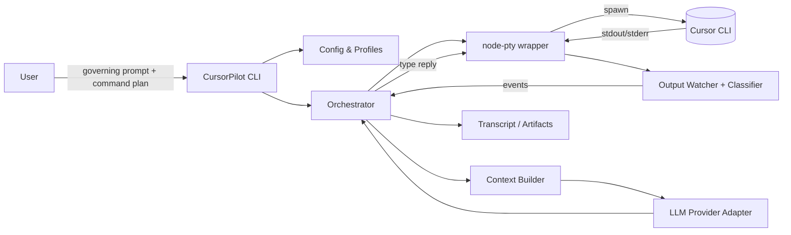
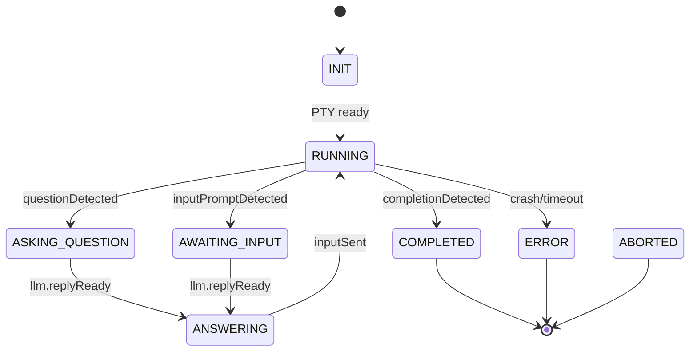

# CursorPilot — Design Doc

## 1) One-liner & Goals

**One-liner:** A TypeScript CLI that **drives Cursor CLI headlessly**. It watches Cursor’s terminal output, detects **questions/confirmation prompts**, and replies with LLM-generated answers that follow a **user-supplied governing prompt**.

**Goals**

* Let a user start the agent with a single command and a “governing prompt” that explains how responses should be framed.
* Run Cursor CLI commands (scaffold, write files, refactor, tests, etc.).
* Detect when Cursor awaits input vs. is working vs. has finished.
* Construct LLM prompts that include: (a) governing prompt, (b) recent Cursor output, (c) current context (filesystem snapshot, command history, etc.), then stream the LLM’s reply back **as keystrokes** to Cursor.
* Be resilient (retries, timeouts, safe-stop).
* Produce auditable logs (transcripts), with optional redaction.

> **Assumptions:**
>
> * Cursor offers a command-line mode that reads/writes to TTY (or at least behaves well under a PTY).
> * Cursor emits recognizable patterns when it asks questions or is idle/complete (we’ll also allow user-configurable regexes).

---

## 2) High-level Architecture



**Key pieces**

* **CLI**: parses args, loads config/profile, kicks off a “run plan”.
* **Orchestrator**: state machine that supervises Cursor process, streaming IO, and LLM calls.
* **PTY wrapper**: spawns Cursor in a pseudo-terminal so it behaves interactively.
* **Output Watcher + Classifier**: classifies Cursor output into states: *Running*, *WaitingForInput*, *Question*, *Error*, *Completed*.
* **Context Builder**: gathers *recent terminal context*, *filesystem deltas*, *run plan step*, *previous Q/A*, to craft the LLM prompt.
* **LLM Provider Adapter**: abstraction over OpenAI/Anthropic/etc. (so you can swap vendors without touching orchestration).
* **Logs/Artifacts**: JSONL transcript, raw stdout/err, prompt/response snapshots, optional redactions.

---

## 3) Workspace Layout

```
cursor-pilot/
  package.json                # root, npm workspaces
  tsconfig.json
  /packages
    /cli                      # bin: cursor-pilot
      package.json
      src/
        index.ts              # entry, arg parsing, boot Orchestrator
        commands/
          run.ts              # primary command (default)
          dry-run.ts          # simulate without typing into PTY
    /core                     # orchestration + domain logic
      package.json
      src/
        orchestrator/
          Orchestrator.ts
          StateMachine.ts     # enums & transitions
          Events.ts
        cursor/
          CursorProcess.ts    # PTY spawn, write, graceful shutdown
          CursorDetectors.ts  # regex/heuristics for questions & completion
          CursorProfiles.ts   # profile templating per Cursor version
        llm/
          Provider.ts         # interface
          OpenAIProvider.ts   # implementation (pluggable)
          AnthropicProvider.ts
          MockProvider.ts
        context/
          ContextBuilder.ts   # assembles prompt inputs
          FileSystemProbe.ts  # watch git diff / changed files
          History.ts          # rolling window tokenizer
        prompts/
          systemPrompt.ts     # base system instructions template
          userPrompt.ts       # inject governing prompt + recent output
        telemetry/
          Logger.ts           # pino-based
          Redactor.ts         # mask tokens, secrets
          Transcript.ts       # JSONL per session
        util/
          timers.ts, errors.ts, tokens.ts
    /detectors                # packaged regexes/ML classifiers
      package.json
      src/
        builtin.ts            # sensible defaults & version tags
    /types
      package.json
      src/index.d.ts
  /docs
    CursorPilot.md            # this doc
```

---

## 4) CLI UX

**Command**

```bash
npx cursor-pilot run \
  --prompt "./prompts/governing.md" \
  --plan "./plan.yml" \
  --cursor "cursor" \
  --cwd ./target-project \
  --log ./runs/run-2025-09-24 \
  --provider openai \
  --model gpt-4.1-mini \
  --dry-run=false \
  --max-steps 50 \
  --timeout 45m
```

**Key Flags**

* `--prompt`: path or literal string with the “governing prompt”.
* `--plan`: optional YAML with sequential steps (each step → one or more Cursor commands).
* `--cursor`: binary name/path for Cursor CLI.
* `--cwd`: working directory to run Cursor in.
* `--provider`, `--model`: LLM provider/model; environment vars hold creds.
* `--dry-run`: don’t actually type into Cursor; just show what we *would* have sent.
* `--max-steps`, `--timeout`: safety guards.
* `--log`: directory for artifacts (stdout, stderr, prompts, answers, transcript JSONL).

**Example governing prompt** (short):

```
Role: Senior TS engineer.
Objective: Drive Cursor to build a monorepo web service with npm workspaces.
Style: Concise. Prefer TypeScript, strict mode, zod validation.
Constraints: Never delete files without explicit confirmation. Always write tests.
When unsure: ask for clarification in 1 short question.
```

---

## 5) Orchestration State Machine

**States**

* `INIT` → spawn PTY & Cursor.
* `RUNNING` → Cursor is doing work; we buffer output.
* `AWAITING_INPUT` → detector signals Cursor is pausing for user input.
* `ASKING_QUESTION` → detector extracts a question; orchestrator queries LLM.
* `ANSWERING` → we type the LLM reply into PTY (end with `\n` or appropriate terminator).
* `COMPLETED` → detector signals successful finish (or plan steps exhausted).
* `ERROR` → process crash, timeouts, or unrecoverable loop.
* `ABORTED` → user Ctrl-C or safety rule triggered.

**Transitions (simplified)**



---

## 6) Detecting Cursor Prompts & Completion

**Approach**

* Start with **regex detectors** (configurable). Examples:

  * Questions:

    * `/\?\s*$/m` (line ends with `?`)
    * `/^Confirm (yes\/no):/i`
    * `/^(Proceed|Continue)\? \[y\/n\]/i`
    * `/^Choose an option \(\d+-\d+\):/i`
  * Input requests:

    * `/^Enter file path:/i`, `/^Provide a commit message:/i`
  * Completion:

    * `/^All tasks (completed|done)\.?$/i`
    * `/^✅ (Build|Refactor|Scaffold) complete/i`
    * Process exit code `0` with no pending prompts.
* Allow **versioned detector profiles** (`detectors/builtin.ts`) so you can tune for different Cursor versions.
* (Optional later) add a **tiny local classifier** (e.g., rule-based + heuristics on punctuation, verbs like “select/confirm/enter”, or a lightweight on-device model) to improve accuracy.

**Debounce & framing**

* Buffer output into a rolling window (e.g., last **2–4k tokens or 200 lines**).
* Only fire a “question” event after **no new output** for `idleThresholdMs` (e.g., 600–1200ms).
* For menus, capture the block between `---BEGIN PROMPT---` and `---END PROMPT---` if Cursor prints such delimiters; if not, heuristically capture **N lines** above the detector line.

---

## 7) Prompting Strategy

**System Prompt (template)**

* Role: *You are an assistant that crafts succinct terminal replies to drive a code-generation CLI (Cursor).*
* Rules:

  1. **Reply only with what should be typed into the terminal** (no explanations).
  2. If the CLI asks for a yes/no, answer with `y` or `n` only.
  3. If a list selection is required, reply with the **index** or exact choice text.
  4. Default to safe, reversible actions. Prefer creating new files over destructive changes unless the governing prompt says otherwise.
  5. Keep answers **single-line** unless the prompt explicitly requests multi-line input.
  6. If insufficient info, **ask ONE short clarifying question** first (prefix with `? `), otherwise proceed.

**User Prompt (constructed each time)**

* Include in order:

  1. **Governing Prompt** (verbatim).
  2. **Current Step/Plan Context** (e.g., “We’re on step 3/8: ‘Add zod schema to REST layer’”).
  3. **Recent Cursor Output** (trimmed).
  4. **Environment Snapshot (optional)**: changed files, package.json scripts, current branch.
  5. **What Cursor is asking** (detector’s extracted question or inferred input schema).
  6. **Answer format reminder** (e.g., “Return just `y` or `n`.”).

**Safety phrasing**

* “If the CLI prompt implies destructive operations (delete/overwrite), choose **no** unless the governing prompt or previous user confirmation allows it.”

---

## 8) Provider Adapter (LLM)

**Interface**

```ts
export interface LLMProvider {
  complete(input: {
    system: string;
    user: string;
    temperature?: number;
    maxTokens?: number;
  }): Promise<{ text: string; tokensUsed: number }>;
}
```

**Providers**

* `OpenAIProvider`: uses env vars (`OPENAI_API_KEY`, model name).
* `AnthropicProvider`: (`ANTHROPIC_API_KEY`)
* `MockProvider`: returns canned answers for tests.

*(Intentionally abstracted: you’ll wire whichever current SDK you prefer.)*

**Rate limiting & retries**

* Exponential backoff on `429/503`; max attempts configurable.
* Token budgeting: keep context under model limits; fall back to **summarized** Cursor history when long.

---

## 9) File System Context

* Lightweight **git probe**:

  * `git status --porcelain` to list changes.
  * `git diff --name-only` or `git diff --shortstat` for volume.
  * Optional: cap file content preview to **first/last N lines** when included.
* **Redaction**: mask `.env` secrets via simple patterns (`API_KEY=`, `TOKEN=`, etc.) before sending to LLM.

---

## 10) Logging & Artifacts

* **Transcript JSONL** (one line per event):

  * `{ ts, type, state, cursorChunk, question, llmPromptHash, llmAnswer, tokens, costEstimate }`
* **Raw stdout/stderr** (rotating files).
* **Prompts/Answers**: write each final prompt and response to `prompts/step-XX/`.
* **Run manifest**: run id, versions, git commit, node version, Cursor version.

Optional:

* **HTML report** with collapsible sections (Cursor output, prompts, answers, diffs).

---

## 11) Error Handling & Safety

* **Guard rails**

  * `--max-steps` & `--timeout` end the session cleanly.
  * “Loop breaker”: if we detect the **same** question 3x with the **same** answer, escalate to user.
  * Refuse to type raw multi-line blocks unless the prompt explicitly requested a multi-line input (support sending EOF `Ctrl+D` if required).
* **Interruptions**

  * Graceful Ctrl-C → send `SIGINT` to Cursor & wait; second Ctrl-C → force kill.
* **Recoverability**

  * Resume mode: `--resume ./runs/run-YYYY.../manifest.json` reattaches plan at last completed step (best-effort).

---

## 12) Config Files

**`plan.yml` example**

```yaml
name: "Bootstrap monorepo"
steps:
  - name: Init repo
    run: ["git init", "npm init -y"]
  - name: Add workspaces
    run:
      - npx @radzion/workspace init # example; replace with your script
  - name: Cursor: scaffold service
    cursor:
      - "cursor create service --name api --template express-ts"
  - name: Cursor: add tests
    cursor:
      - "cursor generate tests --target packages/api"
```

**`detectors.json` override**

```json
{
  "question": [
    "^(Proceed|Continue)\\? \\[y/n\\]",
    "^Choose an option \\(\\d+-\\d+\\):",
    "\\?$"
  ],
  "awaitingInput": ["^Enter .*:", "^Provide .*:"],
  "completion": ["^All tasks complete\\.?$", "^✅ .* complete"]
}
```

---

## 13) PTY Integration (node-pty) — Pseudocode

```ts
import pty from "node-pty";
import { Orchestrator } from "@cursor-pilot/core/orchestrator/Orchestrator";

const shell = process.platform === "win32" ? "powershell.exe" : "bash";
const ptyProc = pty.spawn(shell, [], {
  name: "xterm-color",
  cols: 120,
  rows: 30,
  cwd: options.cwd,
  env: process.env,
});

// Start Cursor inside PTY
ptyProc.write(`${options.cursor} ${cursorArgs.join(" ")}\r`);

ptyProc.onData((data) => orchestrator.handleOutput(data));
ptyProc.onExit((e) => orchestrator.handleExit(e.exitCode));

function typeLine(line: string) {
  ptyProc.write(line.replace(/\n/g, "\r") + "\r");
}
```

---

## 14) Orchestrator Loop — Pseudocode

```ts
while (!done) {
  const event = await watcher.nextEvent(); // emits: running, question, awaitingInput, completed, error

  switch (event.type) {
    case "question":
    case "awaitingInput": {
      const ctx = await contextBuilder.build({
        governingPrompt,
        recentOutput: watcher.window(),
        planStep: plan.current(),
        fsSnapshot: await probeFS(),
        history: history.lastN(10),
      });

      const userPrompt = renderUserPrompt(ctx);
      const systemPrompt = baseSystemPrompt();

      const { text: answer } = await llm.complete({ system: systemPrompt, user: userPrompt });

      transcript.record({ question: event.text, answer });
      typeLine(answer);
      history.add({ q: event.text, a: answer });
      break;
    }

    case "completed":
      done = true;
      break;

    case "error":
      throw event.error;

    default:
      // running; continue buffering
  }
}
```

---

## 15) NPM Workspaces & Scripts

**Root `package.json`**

```json
{
  "name": "cursor-pilot",
  "private": true,
  "workspaces": ["packages/*"],
  "scripts": {
    "build": "npm run -w @cursor-pilot/core build && npm run -w @cursor-pilot/cli build",
    "lint": "biome check .",
    "test": "vitest run"
  },
  "devDependencies": {
    "biome": "^1.9.0",
    "typescript": "^5.6.0",
    "vitest": "^2.0.0"
  }
}
```

**CLI `package.json` (bin)**

```json
{
  "name": "@cursor-pilot/cli",
  "version": "0.1.0",
  "type": "module",
  "bin": { "cursor-pilot": "dist/index.js" },
  "dependencies": {
    "@cursor-pilot/core": "0.1.0",
    "commander": "^12.1.0",
    "node-pty": "^1.0.0"
  },
  "scripts": { "build": "tsc -p tsconfig.json" }
}
```

---

## 16) Testing Strategy

* **Unit**

  * Detectors: feed curated stdout snippets → expected classification.
  * ContextBuilder: ensures redactions, token limits, trimming.
  * LLM Adapter: mock responses; verify prompt shape.
* **Integration**

  * Spawn a **mock Cursor** binary that prints scripted prompts (menu, y/n, text input) and validates the typed replies.
  * Run end-to-end with `--dry-run` and with typing enabled.
* **Golden transcripts**

  * Keep snapshots per scenario; diff on PRs.

---

## 17) Security & Privacy

* Never log secrets; redact `.env` lines and common key patterns.
* Optional `--no-upload` mode: do **not** send filesystem snippets to LLM—only terminal text.
* Support **local-only** providers (mock/offline) for air-gapped runs.

---

## 18) Extensibility Roadmap

* **Learning prompts**: Fine-tune detectors from misclassifications (feedback loop).
* **Toolformer hooks**: When Cursor asks for a file path or code block, auto-compute options from the repo.
* **Guarded actions**: Require human confirmation for destructive ops (delete/move/overwrite).
* **Web dashboard**: Live stream the transcript via ws://.

---

## 19) Example Session (Narrative)

1. User runs `cursor-pilot run --prompt ./prompts/governing.md --plan ./plan.yml`.
2. Orchestrator spawns PTY, launches Cursor’s scaffold command.
3. Cursor prints: “Choose a template (1-React, 2-Next.js, 3-Express):”
4. Detector fires `ASKING_QUESTION`. Context Builder composes prompt with recent stdout and plan step.
5. LLM replies `3`. Orchestrator types `3⏎`.
6. Cursor prints: “Proceed to install deps? [y/n]”
7. LLM replies `y`. Typed in.
8. After building, Cursor prints “✅ Scaffold complete”. Detector marks `COMPLETED`. Logs saved.

---

## 20) Open Questions & Assumptions

* **Cursor CLI behavior**: finalization signals and prompt formats may vary by version. We mitigate with **profiles** and user-overrideable regexes.
* **Multi-line inputs**: if Cursor expects a multi-line block (e.g., commit message), we’ll require a detector hint (e.g., `<<BEGIN MULTILINE>> ... <<END>>`) or a per-command schema in the plan.
* **LLM provider details**: The adapter is vendor-agnostic; you’ll plug in your preferred SDK and model.

---

## 21) MVP Cut

* CLI (`run`) with: PTY spawn, basic detectors, OpenAI provider, transcript logging.
* Single plan step that runs one Cursor command and answers y/n & numeric menu prompts.
* Timeouts, `--dry-run`, `--max-steps`.

---

## 22) Definition of Done (MVP)

* Can drive at least one end-to-end Cursor workflow (scaffold → edit → test) **without human input** using a governing prompt.
* Produces a transcript JSONL and raw logs.
* Detectors configurable via JSON; basic sensible defaults included.
* Graceful shutdown and resumable runs.

---

If you want, I can turn this into a starter repo skeleton (packages, tsconfig, placeholder code, mocks) and a sample `plan.yml` you can run locally.
